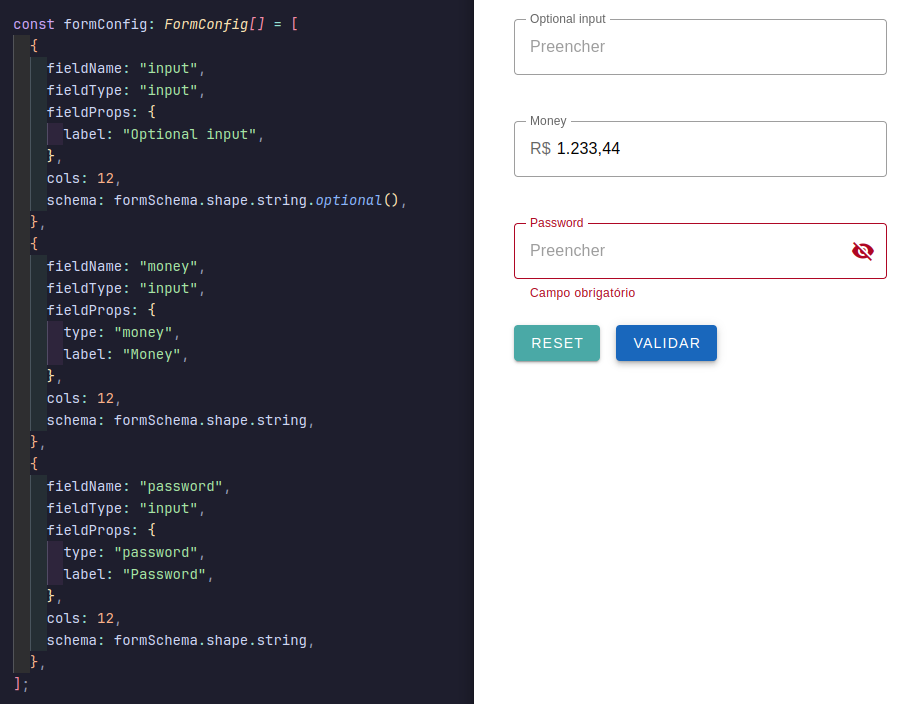

# AutoForm

AutoForm é um gerador de formulários dinâmicos, baseado em um objeto de configuração com validação dos campos via **zod schema**.



## Tecnologias

O AutoForm foi construído utilizando as seguintes tecnologias:

- [Vue 3](https://vuejs.org/)
- [Vuetify](https://vuetifyjs.com/)
- [VeeValidate](https://vee-validate.logaretm.com/v4/)
- [Zod](https://zod.dev/)
- [Maska](https://beholdr.github.io/maska/v3/#/vue)

## Instalação

```bash
# Instalar as dependências
npm install

# Executar o projeto
npm run dev
```

## Tipos de campos

Estes são os tipos de campos suportados até o momento:

- **checkbox:** VInput, VLabel, VCheckbox
- **input:** VTextField
- **radio:** VRadioGroup, VRadio
- **select:** VSelect,
- **textarea:** VTextArea,
- **datePicker:** VMenu, VTextField, VDatePicker,

Os tipos disponíveis estão configurados no objeto `FORM_COMPONENTS` dentro de `components/config.ts`.

## Exemplos de uso

#### Utilização básica:

```vue
<template>
  <auto-form
    v-bind="{ formConfig, formValue }"
    @update:form-value="updateFormValue"
  />
</template>

<script setup lang="ts">
import { ref } from "vue";
import { z } from "zod";
import AutoForm from "./components/auto-form.vue";
import { FormConfig, FormValue } from "./components/types";

// Objeto de configuração para geração do formulário
const formConfig: FormConfig[] = [
  {
    fieldName: "username",
    fieldType: "input",
    fieldProps: {
      label: "Usuário",
      placeholder: "Insira o usuário",
    },
    cols: 6,
    schema: z
      .string({
        required_error: "O usuário é obrigatório",
      })
      .min(3, {
        message: "O usuário deve conter pelo menos 3 caracteres",
      }),
  },
  {
    fieldName: "email",
    fieldType: "input",
    fieldProps: {
      type: "email",
      label: "E-mail",
      placeholder: "Informe o e-mail",
    },
    cols: 6,
    schema: z
      .string({
        required_error: "O e-mail é obrigatório",
      })
      .email({
        message: "E-mail inválido",
      }),
  },
];

// Objeto de configuração para valores iniciais dos campos
const formValue = ref<FormValue<FormConfig[]>>({});

// Função para atualizar os valores do formulário
const updateFormValue = (newValue: FormValue<FormConfig[]>) => {
  formValue.value = newValue;
};
</script>
```

#### Valores default:

valores default ou preenchidos via requisição, por exemplo

```ts
// Estrutura: fieldName: value
const formValue = ref<FormValue<FormConfig[]>>({
  username: "John Doe",
  email: "john_doe@example.com",
});
```

#### Campos com máscara:

Podemos utilizar máscaras pré-definidas para campos do tipo **money, telefone e cep**:

```ts
{
  fieldName: "money",
  fieldType: "input",
  fieldProps: {
    type: "money", // Saída: #.###,##
    label: "Valor monetário",
  },
  schema: z.string()
},
{
  fieldName: "phone",
  fieldType: "input",
  fieldProps: {
    type: "phone", // Saída: (##) #####-####
    label: "Telefone",
  },
  schema: z.string()
},
{
  fieldName: "cep",
  fieldType: "input",
  fieldProps: {
    type: "cep", // Saída: #####-###
    label: "CEP",
  },
  schema: z.string()
}
```

Os tipos disponíveis estão configurados no objeto `TYPE_MASKS` dentro de `components/config.ts`.

Também é possível adicionar a máscara manualmente utilizando a prop `mask` dentro de `fieldsProps`:

```ts
{
  fieldName: "date",
  fieldType: "input",
  fieldProps: {
    label: "Input data com máscara",
    mask: "##/##/####"
  },
  schema: z.string()
}
```
